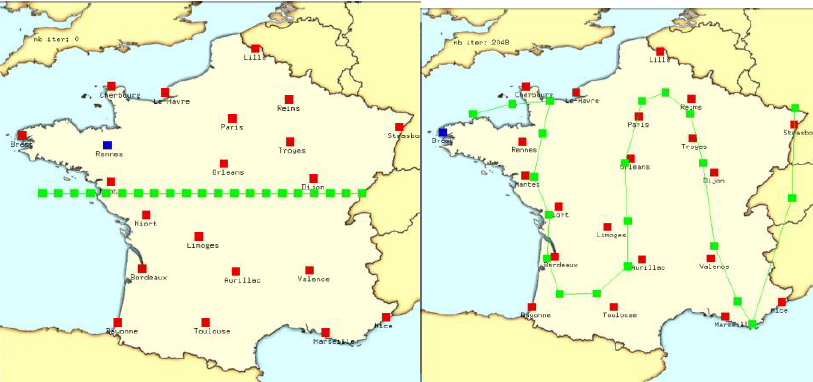
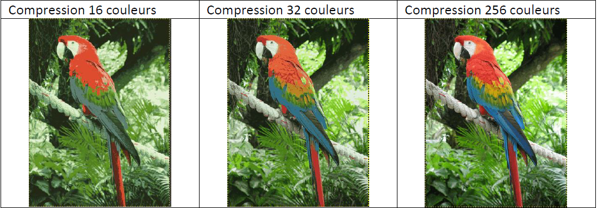

# Kohonen network

This implementation of kohonen networks uses OpenGL and Glut libraries.
You can install them with 
```bash
sudo apt install libglu1-mesa-dev freeglut3-dev mesa-common-dev
```

Then simply build the project with
```bash
make
```

## Application of a 1D Kohonen network to the travelling salesman problem.



Run with 
```bash
./base_opengl carte_france_vierge.ppm
```

## Application of a Kohonen network to the image compression problem



Run with 
```bash
./compression carte_france_vierge.ppm
```

The program will generate a 256-color compressed image of 'perroquet.ppm'